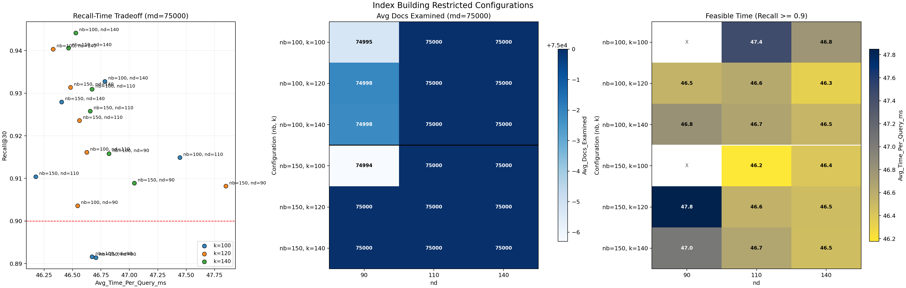
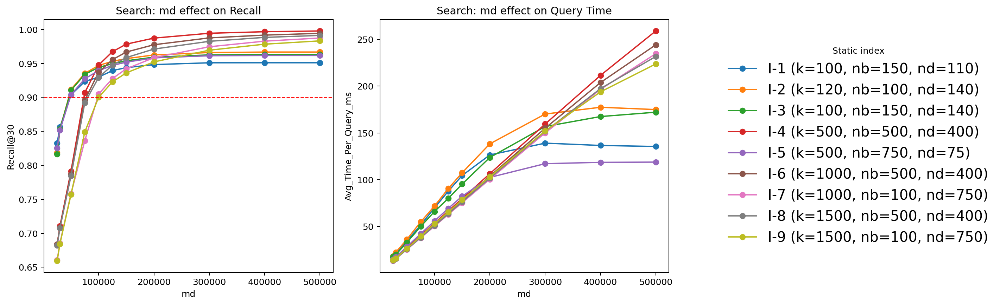
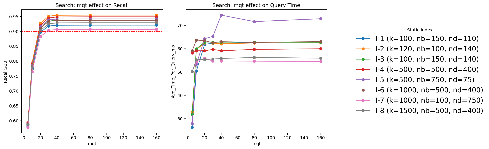
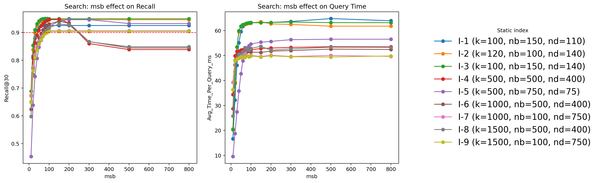
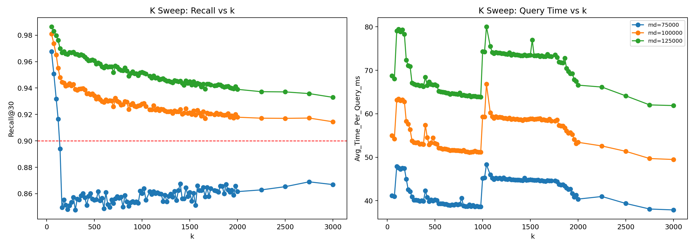

# SISAP 2026 Task 3: Indexing Very Sparse High-Dimensional Vectors

Team: Seed 42, ID 64

This repository contains the final implementation and experimental study for the SISAP 2026 Task 3 challenge.

Task 3, as defined by the challenge, asks participants to design scalable and memory-efficient indexing methods for very high-dimensional sparse vectors under realistic hardware constraints. The benchmark uses SPLADE-v3 sparse embeddings and focuses on information retrieval style search over extremely sparse learned representations.

## What this project studies

The core idea of this work is a custom sparse indexing structure called **InvertedBlock**. It combines:

- document clustering for coarse partitioning,
- exact per-cluster maximum summaries for safe upper bounds,
- per-term inverted blocks with limited block and document fan-out,
- query-time CaaT traversal with pruning controls.

The study in the paper evaluates two phases:

1. **Index building experiments** to choose a compact but permissive index configuration.
2. **Search parameter experiments** to measure the latency-recall trade-off of the final search engine.

The final selected index families are:

- I-1: $(k,nb,nd)=(100,150,110)$
- I-2: $(120,100,140)$
- I-3: $(100,150,140)$
- I-4: $(500,500,400)$
- I-5: $(500,750,75)$
- I-6: $(1000,500,400)$
- I-7: $(1000,100,750)$
- I-8: $(1500,500,400)$
- I-9: $(1500,100,750)$

## Main conclusions

- The custom index can reach Recall@30 above 0.90 while keeping practical query latency.
- The index-building stage shows that a restricted but well-chosen $(k, nb, nd)$ combination is enough to preserve the useful candidate pool.
- In search, `md` is the dominant global control, `msb` is the main secondary quality knob, and `mqt` is a finer efficiency control once enough query terms are retained.
- The final design is mathematically safe at the block level because cluster summaries use exact maxima.

## Final plots

The figures below highlight the main conclusions from the paper.

### Index building summary



This plot summarizes the restricted index-building experiments and motivates the nine final index configurations used in search.

### Recall and latency versus md



This is the main latency-recall frontier. Recall rises monotonically with `md`, while latency increases until the candidate budget saturates.

### Effect of max query terms



This plot shows that low `mqt` values remove too much useful signal, but beyond a moderate term budget the gain becomes small.

### Effect of max search blocks



This is the clearest secondary search control. The best trade-off appears around `msb ≈ 150`.

### Cluster count trend



This plot shows how cluster granularity shapes the recall ceiling before search-time pruning is applied.

## Repository layout

- `src/`: C++ implementation and executable entry point
- `include/`: public headers for clustering, indexing, search, and utilities
- `config/`: experiment configuration files
- `data/`: HDF5 datasets used by the benchmark
- `results/`: generated CSV outputs and run artifacts
- `report/`: paper source, final figures, and experiment CSVs

## Build and run

The project is built with CMake and vcpkg.

```bash
./build.sh
```

Or manually:

```bash
cmake -B build \
	-S . \
	-DCMAKE_TOOLCHAIN_FILE=$HOME/vcpkg/scripts/buildsystems/vcpkg.cmake

cmake --build build
```

Run the executable with the default task configuration:

```bash
./run.sh
```

Or directly:

```bash
./build/main --dataset nq --task task3 --params clusters
```

## Outputs

Experimental runs append results to CSV files in `results/` and the paper stores the final summarized tables in `report/final_csv_results/`.

